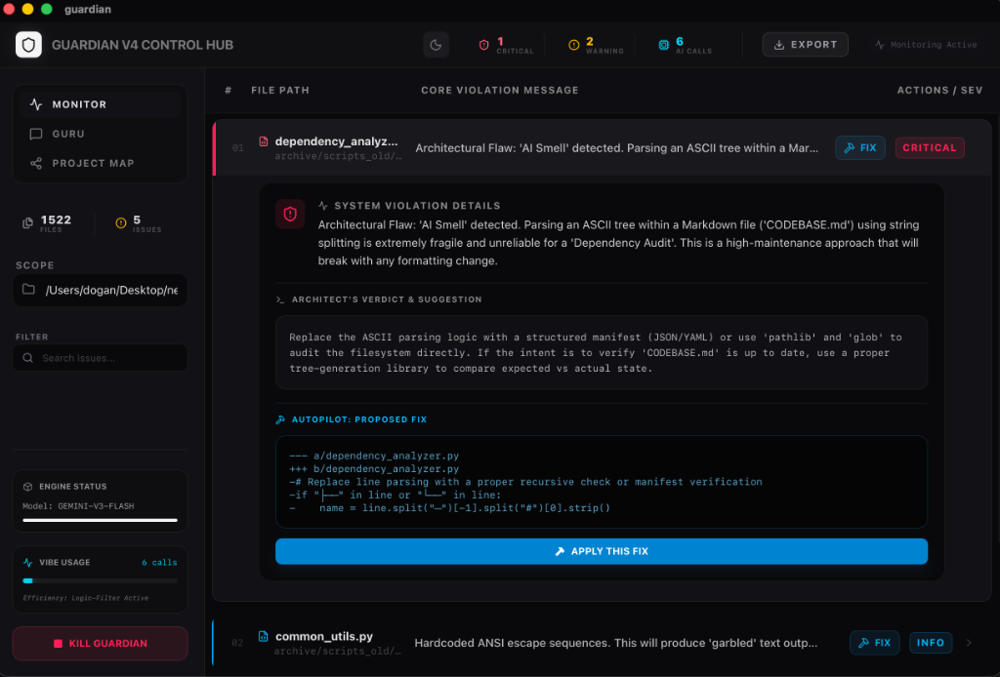
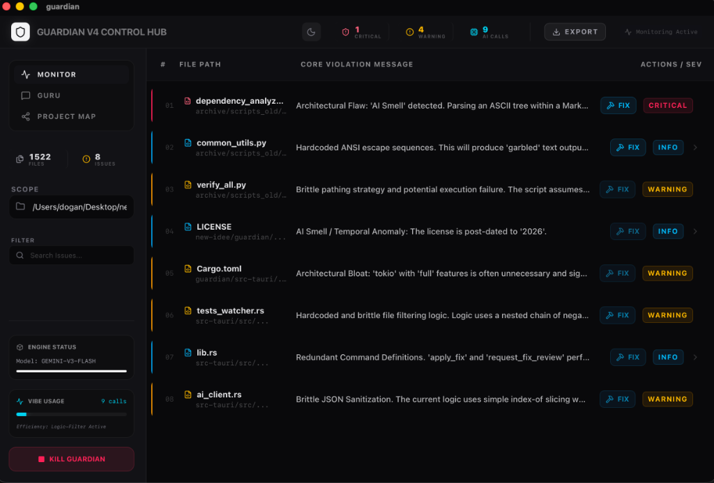
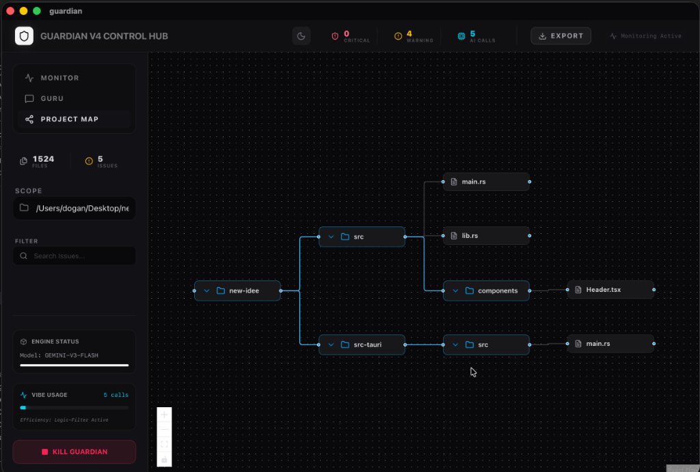
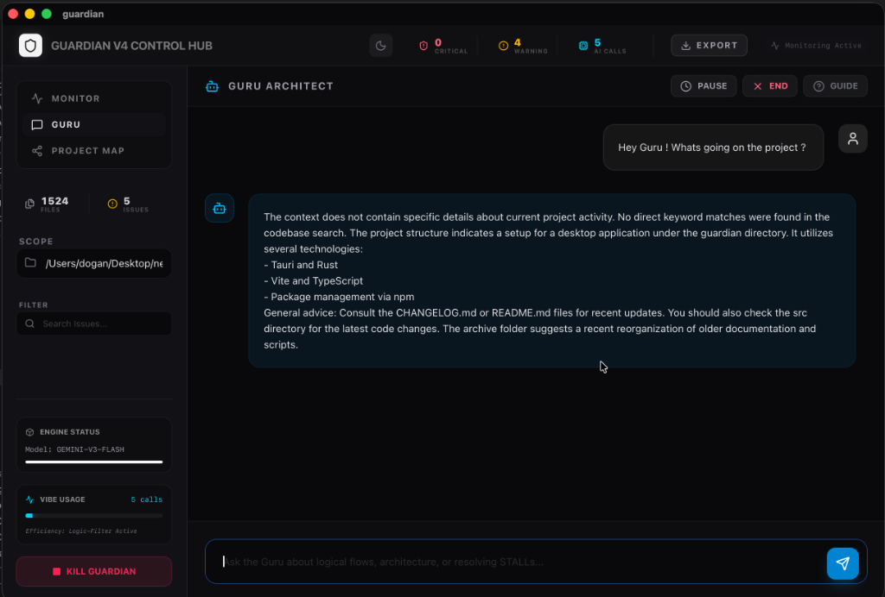

# Guardian v1.0.0 🚀
### Advanced Architectural Governance and Code Security Protocol
### Gelişmiş Mimari Yönetişim ve Kod Güvenliği Protokolü

[](./CHANGELOG.md)
[](./scripts/setup-runner.sh)
[](LICENSE)

Guardian is a sophisticated development supervisor engineered to maintain system integrity through real-time architectural oversight and automated remediation. It bridges the gap between static analysis and active governance.

Guardian, gerçek zamanlı mimari denetim ve otomatik iyileştirme yoluyla sistem bütünlüğünü korumak için tasarlanmış gelişmiş bir geliştirme denetçisidir. Statik analiz ile aktif yönetişim arasındaki boşluğu doldurur.

<p align="center">
  
  
</p>
<p align="center">
  
  
</p>

---

## 🆕 What's New in v1.0.0

### Major Changes
- ✅ **Self-Hosted CI/CD**: Zero GitHub Actions minutes with local runner
- ✅ **Production Ready**: Stable 1.0.0 release
- ✅ **Enhanced Security**: Improved CSP and authentication flow
- ✅ **Website v1.0.0**: Public website with download/changelog/docs

---

## 🏗️ Architecture

### Core Components

#### Sentry Engine / Sentry Motoru
**[EN]** Continuous, passive monitoring of the file system. Identifies anti-patterns, performance regressions, and security vulnerabilities.

**[TR]** Dosya sisteminin sürekli izlenmesi. Anti-pattern'leri ve güvenlik açıklarını tespit eder.

#### Architect Intelligence / Mimari Zeka
Context-sensitive patches and automated remediation based on project documentation.

---

## 🚀 Quick Start

### Prerequisites
- Node.js v22+
- Rust v1.75+
- macOS 12+ (Apple Silicon or Intel)

### Installation
```bash
git clone https://github.com/senoldogann/Guardian.git
cd guardian
npm install
```

### Development
```bash
# Desktop app
npm run tauri dev

# Website
cd website && npm run dev
```

---

## 🔧 CI/CD Setup (Self-Hosted)

We use **self-hosted GitHub Actions runner** to avoid minutes limits. Setup in 3 steps:

### 1. Run Setup Script
```bash
bash scripts/setup-runner.sh
```

### 2. Configure Runner
```bash
cd ~/github-runner-guardian
./config.sh --url https://github.com/senoldogann/Guardian --token <GITHUB_TOKEN>
```

### 3. Start Runner
```bash
# Manual run
./run.sh

# Or install as service (recommended)
./svc.sh install
./svc.sh start
```

**✅ Your CI/CD is now live!**

---

## 📊 CI/CD Pipeline

Our zero-cost pipeline runs on your local machine:

| Stage | Description | Trigger |
|-------|-------------|---------|
| **Test & Build** | Unit tests, coverage, build | Every push |
| **Tauri Build** | Desktop app compilation | Main branch |
| **Website Build** | Next.js static generation | Main branch |
| **E2E Tests** | Playwright browser tests | PR only |
| **Security Scan** | npm audit, cargo audit | Every push |

**Workflow file:** `.github/workflows/ci-cd-v1.yml`

---

## 🧪 Testing

```bash
# Unit tests
npm run test

# Coverage
npm run test:coverage

# E2E tests
npm run test:e2e
```

---

## 📦 Distribution

Guardian uses **private source + public distribution** model:

- **Source Repo** (private): This repository
- **Distribution Repo** (public): [guardian-distribution](https://github.com/senoldogann/guardian-distribution)

### Required Secrets
```
PUBLIC_DIST_REPO=senoldogann/guardian-distribution
PUBLIC_DIST_REPO_TOKEN=<PAT with write access>
GITHUB_RELEASE_OWNER=senoldogann
GITHUB_RELEASE_REPO=guardian-distribution
```

---

## 🛡️ Security

- CSP headers configured
- Device flow authentication
- Offline-first telemetry
- Automated security scanning

See [SECURITY.md](./SECURITY.md) for details.

---

## 📝 Changelog

See [CHANGELOG.md](./CHANGELOG.md) for version history.

---

## 🤝 Contributing

1. Fork the repository
2. Create feature branch: `git checkout -b feature/amazing-feature`
3. Run tests: `npm run test && cargo check`
4. Commit: `git commit -m 'feat: add amazing feature'`
5. Push: `git push origin feature/amazing-feature`
6. Open Pull Request

**Note:** Main branch is protected. CI must pass before merge.

---

## 📄 License

MIT License - see [LICENSE](LICENSE) for details.

---

<p align="center">
  <strong>Guardian v1.0.0</strong> — Built with ❤️ using Tauri + React + TypeScript
</p>

<p align="center">
  Copyright 2026 Guardian Protocol. All rights reserved.
</p>
